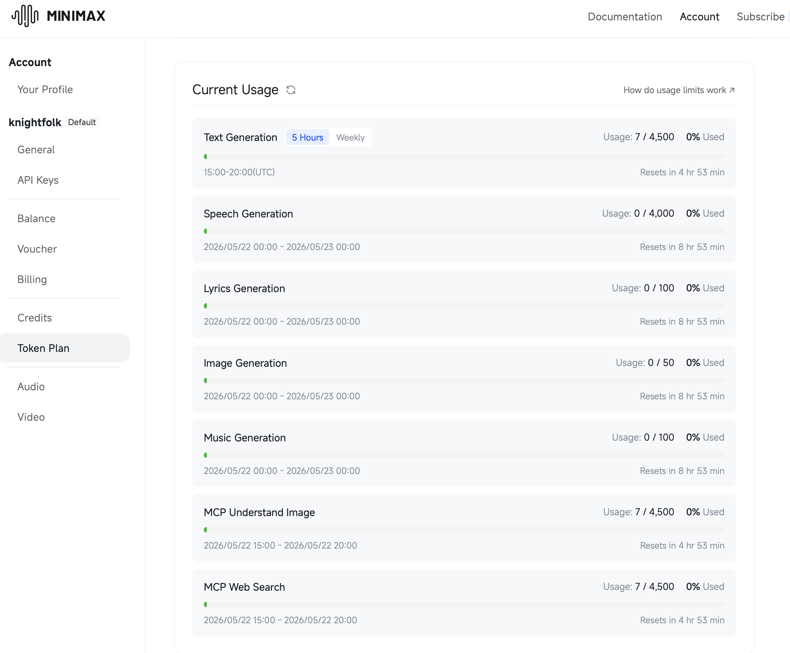

# Lumen

**Automatic light mode switching for macOS based on real-world ambient light conditions.**

[](https://www.apple.com/macos)
[](LICENSE)

Lumen is a lightweight macOS menu bar utility that monitors your MacBook's ambient light sensor and automatically switches between Light and Dark mode. No manual toggling required — your Mac adapts to your environment just like your iPhone does.


---

## Features

### Automatic Appearance Switching
- Reads real-time lux data from your MacBook's ambient light sensor
- Automatically switches to Light mode when you're in bright environments
- Automatically switches to Dark mode when lighting dims
- No user interaction required after initial setup

### Configurable Lux Thresholds
Six customizable light levels:

| Level | Lux Range | Description |
|-------|-----------|-------------|
| 🌑 Cave Dweller | 0–10 lux | Pitch black environments |
| 🕯️ Cozy Corner | 10–100 lux | Dim indoor lighting |
| 💡 Office Warrior | 100–400 lux | Normal indoor office lighting |
| ☁️ Cloud Browsing | 400–6,400 lux | Overcast day or bright indoor |
| 🌊 Beach Mode | 6,400–12,800 lux | Sunny day with indirect light |
| ☀️ Solar Panel | 12,800+ lux | Direct sunlight |

### Smart Behavior
- **Debounce/Hysteresis**: Prevents rapid toggling when light levels fluctuate near thresholds (configurable delay)
- **Clamshell Mode Detection**: Gracefully pauses automatic switching when your MacBook is in lid-closed display mode
- **Conflict Resolution**: Intelligently handles conflicts with macOS's built-in Auto mode
- **Launch at Login**: Optional startup item for always-on automatic switching

### Menu Bar Interface
- Non-intrusive menu bar icon showing current light level
- Quick access to settings and manual override
- Real-time lux value display
- Current level indicator with descriptive name

### Privacy First
- All sensor processing happens locally on your device
- No data leaves your Mac — ever
- No analytics, telemetry, or cloud services
- Settings stored locally in UserDefaults

---

## Installation

### DMG (Recommended)
1. Download the latest `Lumen-x.x.x.dmg` from the [Releases](https://github.com/your-repo/Lumen/releases) page
2. Mount the DMG and drag **Lumen.app** to your Applications folder
3. Launch Lumen from Applications

### Building from Source

#### Requirements
- macOS 14.0 or later
- Xcode 15.3 or later
- MacBook with ambient light sensor (most models)

#### Build Steps
```bash
# Clone the repository
git clone https://github.com/your-repo/Lumen.git
cd Lumen

# Build the project
xcodebuild -project Lumen.xcodeproj -scheme Lumen -destination 'platform=macOS' build
```

The built app will be in `~/Library/Developer/Xcode/DerivedData/Lumen-*/Build/Products/Release/Lumen.app`

---

## Usage

### First Launch
1. Launch Lumen from Applications or the DMG
2. Lumen will appear in your menu bar with a sun/moon icon
3. Click the icon to access settings

### Settings Overview



#### Threshold Configuration
- Adjust individual lux thresholds for each light level
- Use the slider or direct input to set values
- Visual feedback shows current sensor reading

#### Debounce Settings
- Configure the delay before switching modes
- Prevents flickering in marginal lighting conditions
- Default: 5 seconds

#### Clamshell Mode
- Toggle automatic pause when lid is closed
- Default: Enabled

#### Launch at Login
- Enable to start Lumen automatically on login
- Default: Disabled

### Menu Bar Menu
- **Current Level**: Shows active lux threshold level
- **Lux Reading**: Live ambient light value
- **Appearance Mode**: Shows current Light/Dark/Auto state
- **Open Settings...**: Opens the settings window
- **Quit Lumen**: Exits the application

---

## App Sandbox & Distribution

Lumen is distributed **outside the Mac App Store** because App Sandbox blocks the IOKit access required to read the ambient light sensor. This is a fundamental limitation — Apple does not provide an API for ambient light sensor access through sandboxed apps.

If you encounter a "Developer cannot be verified" warning:
1. Right-click **Lumen.app** → **Open**
2. Click **Open** in the dialog
3. The app will launch successfully

---

## Distribution (For Developers)

If you're preparing a release build for distribution:

### 1. Configure Signing
Edit `scripts/notarize.sh` and set your Developer ID Application signing identity:
```bash
export CODE_SIGN_ID="Developer ID Application: Your Name (TEAMID)"
```

### 2. Build & Notarize
```bash
bash scripts/notarize.sh
```

The script will:
- Build the app in Release mode
- Sign the app with your Developer ID
- Create a DMG with proper formatting
- Submit to Apple's Notary Service

### 3. Staple (After Approval)
After Apple approves the notarization (typically within an hour):
```bash
xcrun stapler staple /path/to/Lumen.app
```

### 4. Verify
Check entitlements and signing:
```bash
bash scripts/verify-entitlements.sh
```

---

## Project Structure

```
Lumen/
├── Sources/
│   ├── ALS/              # Ambient Light Sensor reader
│   ├── App/              # Application entry point and delegates
│   ├── Appearance/       # Appearance mode switching logic
│   ├── Bridging/         # IOKit and private API bridging
│   ├── Clamshell/        # Clamshell mode detection
│   ├── Engine/           # Threshold engine and settings
│   ├── UI/               # Menu bar and settings UI
│   └── Protocols.swift   # Shared protocols
├── Resources/
│   ├── Assets.xcassets/   # App icons
│   └── Images/           # Avatars and backdrop images
├── Lumen.entitlements    # App entitlements (no sandbox)
└── Info.plist           # App configuration
```

---

## Testing

The project includes comprehensive unit tests:
```bash
xcodebuild -project Lumen.xcodeproj -scheme LumenTests test
```

---

## Privacy

Lumen reads ambient light sensor data **entirely on your local device**. No sensor data, usage statistics, or any other information leaves your Mac. All settings are stored locally in `UserDefaults` and are not synced to iCloud.

---

## License

MIT License - See [LICENSE](LICENSE) for details.