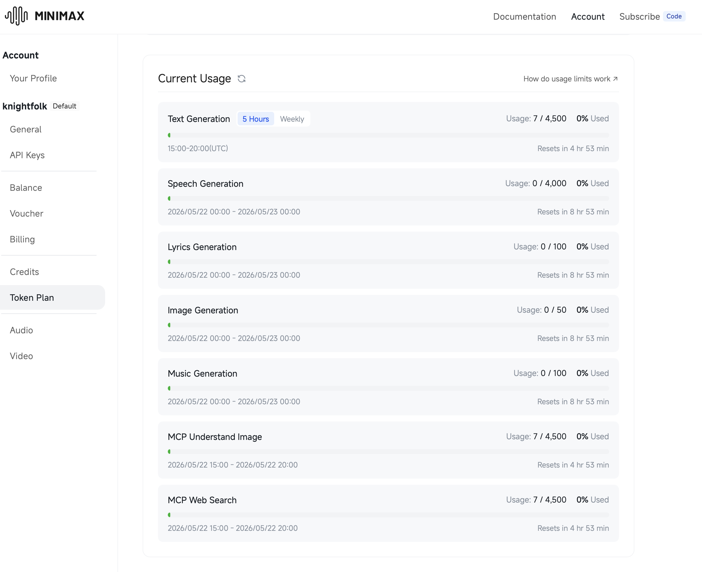

# Lumen

**Automatic light/dark mode switching for macOS — powered by your MacBook's ambient light sensor.**

[](https://www.apple.com/macos)
[](https://swift.org)
[](LICENSE)

Lumen is a lightweight macOS menu bar utility that monitors your MacBook's built-in ambient light sensor and automatically switches between Light and Dark appearance — no manual toggling required. Your Mac adapts to your environment just like your iPhone does.



---

## How It Works

Lumen reads real-time lux data from your MacBook's ambient light sensor using multiple IOKit methods with automatic fallback:

| Priority | Method | Description |
|----------|--------|-------------|
| 1 | HID Event | Direct sensor reading via BezelServices |
| 2 | IORegistry | `AppleBacklightDisplay` `CurrentLux` property |
| 3 | LMU Controller | AppleLMUController kernel service |
| 4 | DisplayServices | Aggregated lux from DisplayServices framework |

When the ambient light level crosses your configured threshold, Lumen switches the system appearance using SkyLight private APIs with AppleScript fallback.

---

## Features

### Configurable Threshold

Set the brightness level that triggers Light mode using a logarithmic slider.

### Quick Set

One-click button sets the threshold to 90% of the current ambient reading — useful for calibrating to your specific environment.

### Debounce Delay

Configurable delay (5s, 10s, or 20s) prevents rapid toggling when light levels fluctuate near the threshold. Uses hysteresis with a 30% dead band to ensure stable switching.

### Clamshell Mode Detection

Automatically pauses sensor polling when the MacBook lid is closed using IOKit push notifications — no shell commands or `ioreg` polling.

### Manual Override Detection

When you manually change the appearance (via Control Center or System Settings), Lumen detects the change and pauses auto-switching for 5 minutes to respect your preference.

### macOS Auto Mode Conflict Resolution

On first launch, Lumen checks for and disables macOS's built-in "Automatically switch appearance" feature to prevent conflicts.

### Launch at Login

Optional startup item using `SMAppService` (macOS 13+). Toggle directly from the settings popover.

---

## Installation

### Download

1. Download the latest `Lumen-x.x.x.dmg` from [Releases](https://github.com/knightfolk/Lumen/releases)
2. Mount the DMG and drag **Lumen.app** to your Applications folder
3. Launch Lumen from Applications

### Building from Source

**Requirements:** macOS 14.0+, Xcode 15.3+, MacBook with ambient light sensor

```bash
git clone https://github.com/knightfolk/Lumen.git
cd Lumen
xcodebuild -project Lumen.xcodeproj -scheme Lumen -destination 'platform=macOS' build
```

The built app will be in `~/Library/Developer/Xcode/DerivedData/Lumen-*/Build/Products/Release/Lumen.app`.

---

## Usage

### First Launch

1. Launch Lumen — it appears as a sun/moon icon in the menu bar
2. Click the icon to open the settings popover
3. Adjust the threshold slider to your preference
4. Lumen begins monitoring immediately

### Menu Bar

- **Left-click** the icon to open the settings popover
- **Right-click** the icon for a quick menu (current mode + Quit)

### Settings

- **Current Measurement** — live lux reading with color indicator
- **Quick Set** — sets threshold to 90% of current reading
- **Threshold** — logarithmic slider from 10 to 100,000 lux
- **Delay** — debounce duration before switching (5s / 10s / 20s)
- **Active / Unpause** — toggle automatic switching on/off
- **Quit** — exit Lumen

---

## App Sandbox

Lumen is distributed **outside the Mac App Store** because App Sandbox blocks the IOKit access required to read the ambient light sensor. This is a fundamental macOS limitation — Apple does not provide a public API for ambient light sensor data.

If you see a "Developer cannot be verified" warning:
1. Right-click **Lumen.app** → **Open**
2. Click **Open** in the dialog

---

## Architecture

```
Lumen/Sources/
├── App/           # main.swift, AppDelegate, MainAppController, LaunchAtLoginManager
├── ALS/           # ALSReader, ALSReading (ambient light sensor I/O)
├── Appearance/    # AppearanceSwitcher, AppearanceState, AppleScriptRunner
├── Engine/        # ThresholdEngine, ThresholdConfig, SettingsStore, DebounceTimer
├── Clamshell/     # ClamshellDetector, ClamshellState (lid state via IOKit)
├── UI/            # MenuBarController, SettingsViewController, StatusBarIcon
├── Bridging/      # PrivateAPILoader, IOKitBridging, Lumen-Bridging-Header.h
└── Protocols.swift
```

Key design decisions:
- **Protocol-based dependency injection** — all core components implement protocols for testability
- **Multi-source ALS fallback cascade** — HID → IORegistry → LMU → DisplayServices
- **Multi-method appearance switching** — SkyLight Notifying → SkyLight Legacy → AppleScript
- **Push-based clamshell detection** — IOKit interest notifications, not polling

---

## Testing

```bash
xcodebuild -project Lumen.xcodeproj -scheme LumenTests -destination 'platform=macOS' test
```

Tests cover threshold engine logic, debounce/hysteresis, settings persistence, launch-at-login, protocol conformance, and graceful degradation for missing hardware.

---

## Distribution (For Developers)

```bash
# Configure your Developer ID in scripts/notarize.sh
bash scripts/notarize.sh [path/to/Lumen.app]
```

The script signs the app with your Developer ID, verifies the signature, and creates a DMG. See `scripts/notarize.sh` for notary submission options.

Verify entitlements:
```bash
bash scripts/verify-entitlements.sh [path/to/Lumen.app]
```

---

## Privacy

Lumen processes all sensor data **entirely on your device**. No data leaves your Mac — no analytics, no telemetry, no cloud services. Settings are stored locally in `UserDefaults` and are not synced to iCloud.

---

## License

[MIT License](LICENSE)
